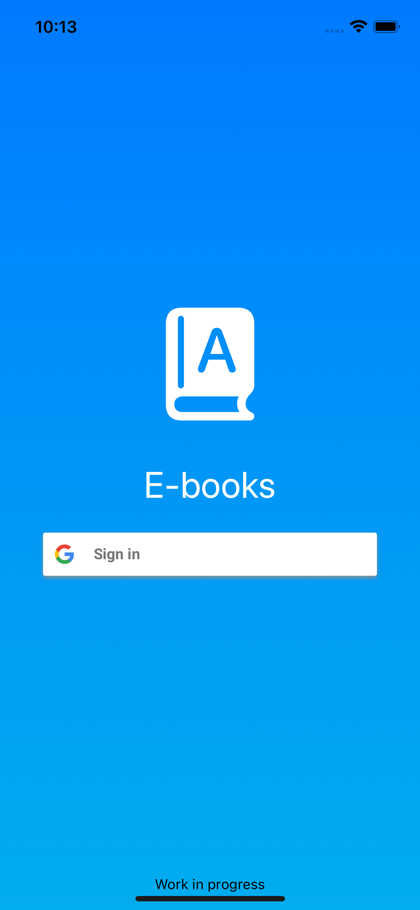
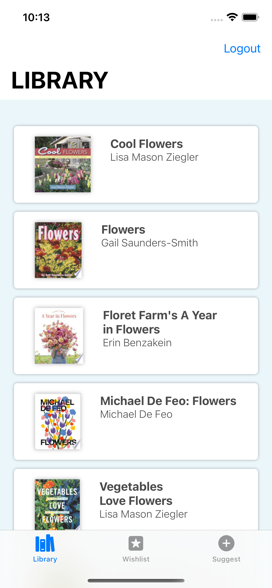
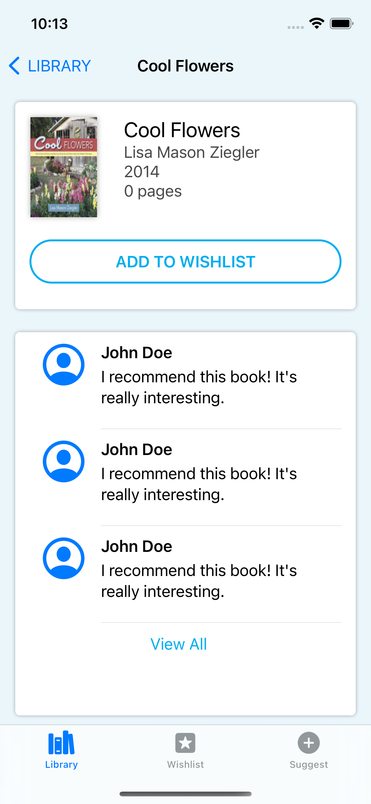

Some core screens:

<p align = "center">
 
 
</p>

## Table of contents
* [General info](#general-info)
* [Technologies](#technologies)
* [Setup](#setup)
* [Improvements](#improvements)
* [User notes](#user-notes)
* [Owner notes](#owner-notes)

## General info
This project is an E-books catalog browser and served its initial purpose as a Proof of Concept for the (At the moment this project was conceived) brand new SwiftUI framework.

It has the following capabilities:
* Log in through your own personal Google account
* Browse through some available books
* Browse over book details and their associated comments
* Add books you are interested in, to your own personal wishlist 
* Browse your recently browsed books history
* Suggest new books to be added (But not really...)
	
## Technologies
Project is created with:
* MVVM design pattern
* SwiftUI framework
* Combine framework
* Codable protocol
* URLSession
* Google Books APIs (https://developers.google.com/books)
* Google Identity (https://developers.google.com/identity)
	
## Setup
To run this project, install the required frameworks using CocoaPods:

```
$ cd ../SwiftUITraining
$ pod install
```

## Improvements
There are several improvements that could be done:

* Instead of hardcoding a book search for the library tab, we could implement an actual search bar for books to be displayed dynamically based on user input
* Allow the user to clear the browsed books history
* Allow the user to remove a wishlisted book from the wishlist tab
* User comments could be fetched through another API instead of being hardcoded
* Allow users comment on books
* Make the suggest submital actually do something

## User Notes
All interaction made thorugh the app will be reflected on the Google account's used. Please use a Google account that you feel comfortable your **My library** changing.

Also, be aware that for the Google API services to be fully functional, your Google account mail address has to be addded to the Google's console project test users.

The most used API documentation links used on the coding side inside Xcode were [this one](https://developers.google.com/books/docs/v1/using) for the Google Books APIs and [this one](https://developers.google.com/identity/sign-in/ios/start-integrating) for Google Identity's.

## Owner Notes
This is a note for myself the owner of the project, for when anyone asks me to be added as a test user:

[Google's console](https://console.cloud.google.com) -> APIs & Services -> OAuth consent screen -> Test users -> + Add users
