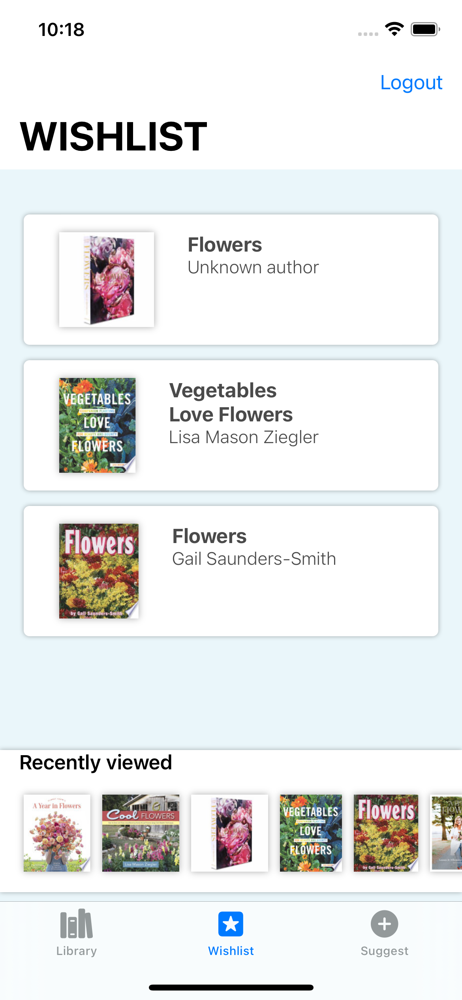

Some core screens:

 

## Table of contents
* [General info](#general-info)
* [Technologies](#technologies)
* [Setup](#setup)

## General info
This project is a simple E-books catalog browser and served its initial purpose as a Proof of Concept for the (At the current moment this project was conceived) brand new SwiftUI framework.

The app currently has all its JSONS hardcoded with Myjson. Additionally, the "Add to wishlist" and "Rent" buttons from the "BookDetailAbout.swift" file serves no purpose whatsoever at the moment. Same applies to the "Submit" button on the Suggest tab.
	
## Technologies
Project is created with:
* MVVM design pattern
* Swift UI framework
* Combine framework
* Codable protocol
* URLSession
* Myjson JSON store (https://myjson.dit.upm.es)
	
## Setup
To run this project, there is no additional setup to be done.
